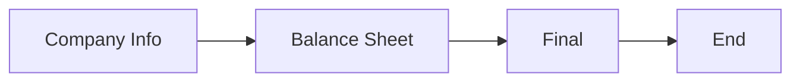

# Visualización del Workflow del Agente

Este directorio contiene scripts para exportar y visualizar el workflow (StateGraph) del agente como una imagen PNG usando Mermaid.

## Requisitos
- Node.js
- Mermaid CLI: instalar con
  npm install -g @mermaid-js/mermaid-cli

## Uso
1. Genera el archivo Mermaid:
   python3 mermaid_export_simple.py

2. Genera la imagen PNG:
   mmdc -i workflow_graph.mmd -o workflow_graph.png -p puppeteer-config.json

3. Visualiza la imagen:
   Abre `workflow_graph.png` con cualquier visor de imágenes.

## Archivos
- `mermaid_export_simple.py`: Script para exportar el workflow a Mermaid (.mmd)
- `workflow_graph.mmd`: Código Mermaid generado
- `workflow_graph_fixed.mmd`: Versión corregida (si la necesitas)
- `puppeteer-config.json`: Configuración para ejecutar mmdc como root
- `workflow_graph.png`: Imagen PNG generada

## WORKFLOW
---

